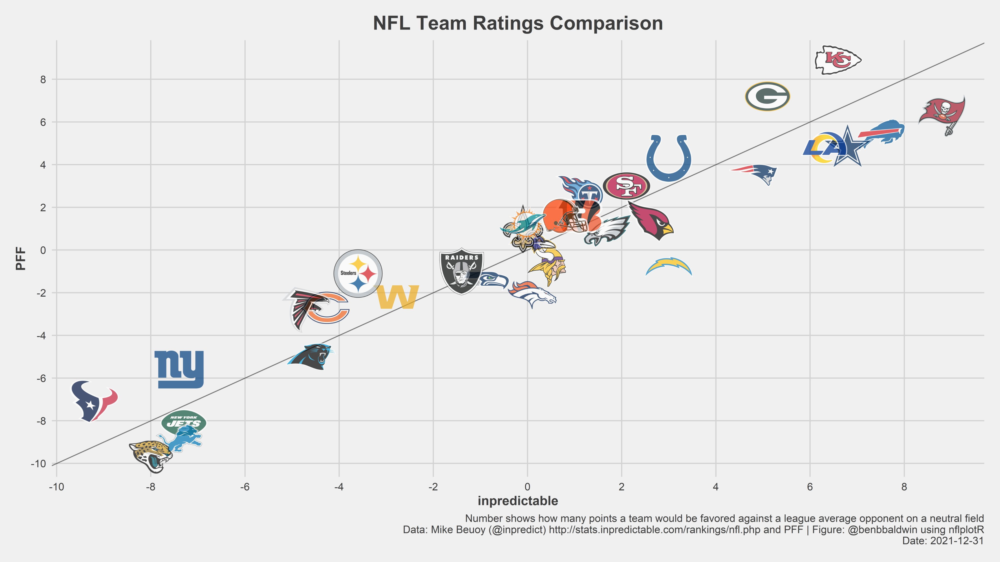
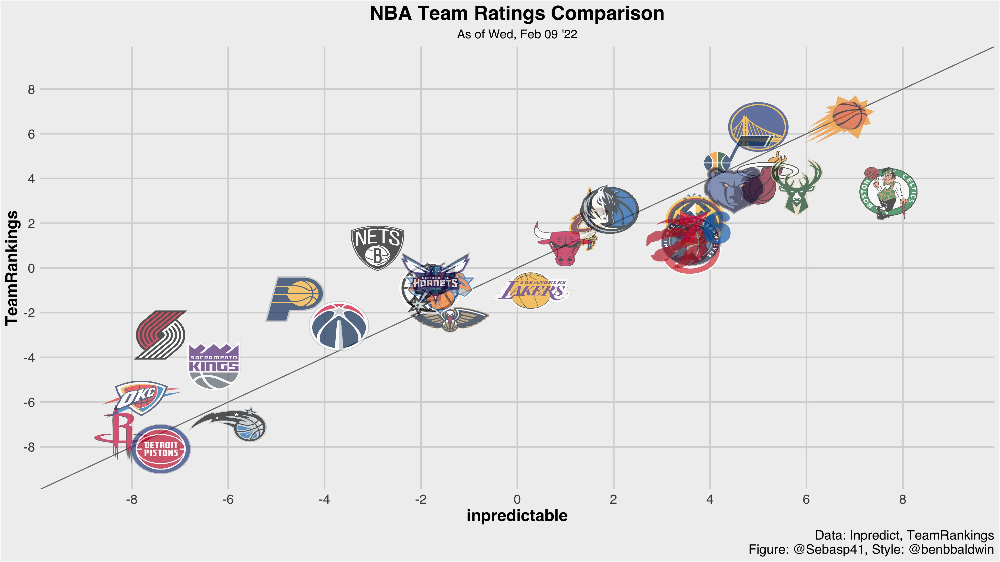

I like trying to copy things that I find interesting on the internet, just to teach myself about how to use scrape, clean, and visualize data using R. You might already recognize @benbbaldwin tweets about all things NFL notable:



Given that I'm  a basketball fan myself, I'm going to translate the chart to an NBA equivalent. Instead of using Pro Football Focus' statistic in the graph above, I'll use TeamRankings' predictive metric available [here](https://www.teamrankings.com/nba/ranking/predictive-by-other/). The statistic from inpredictable is available [here](http://stats.inpredictable.com/rankings/nba.php).

Pretty good right? The NBA version looks a lot more crowded. It is interesting to see TeamRankings liking the Pacers a little better, while Inpredictable valuing the Boston Celtics very highly, among the likes of the hot upstart Memphis Grizzlies. 

I'm not totally interested in posting the code used to scrape the data, because while I think scraping is great I'm not trying to open highways for people. This project was a challenge for me to see how close I can get to @benbbaldwin's image without having to rely on a dedicated NBA stats package. 

What about an animated version of the chart? The following leverages the gganimate package to look at how teams have fared in the eyes of the betting markets over the last week.

At the time this data was harvested and visualized, the Celtics had an interesting run, while the Suns were clear cut betting favorites. It's also a day before the trade deadline comes through, meaning we should see some increased variability in the coming days. 