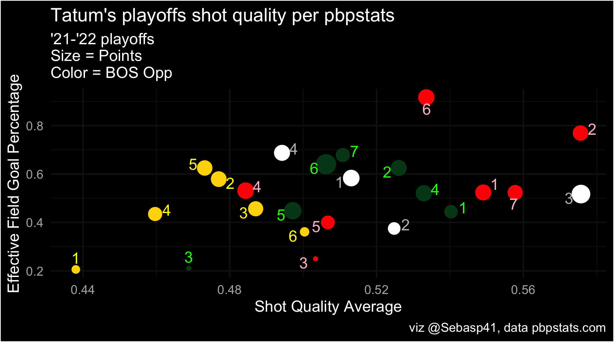

What comes first, assuming a star player is cold or the opponent finding a good answer for said start player?

It's technically not discernable from this first image above. It shows that Jayson Tatum's Shot Quality and Effective Field Goal percentages were good during his playoff run, up until being consistently held up by the Golden State Warriors (GSW - gold). I do think that it's reasonable to think GSW figured something out. Check out the regular season DRtg's (basketball-reference.com) of each Boston opponent in the playoffs.

| Team                  | DRtg  | Rank |
|:----------------------|:------|:-----|
| Golden State Warriors | 106.9 | 1    |
| Miami Heat            | 109.1 | 5    |
| Milwaukee Bucks       | 111.8 | 11   |
| Brooklyn Nets         | 112.8 | 19   |

Tatum seemingly struggled during the initial series during the Nets, but he averaged about 7 assists per game so he was clearly able to get his teammates involved in the sweep. He played extremely well against the Bucks from an efficiency standpoint, and Tatum's series against the Heat was probably most impressive given their DRtg during the season.

All to say that I think taking regular season Opponent DRtg into consideration when analyzing Tatum's performance could show us just how much better GSW was in answering the call to stop the Boston star. GSW was head and shoulders above the other teams in terms of defense, and were able to stifle the MVP's team, a top-5 ORtg team, and one of the premiere rising stars in Luka Doncic. It's not necessarily a list to be ashamed to be on.
